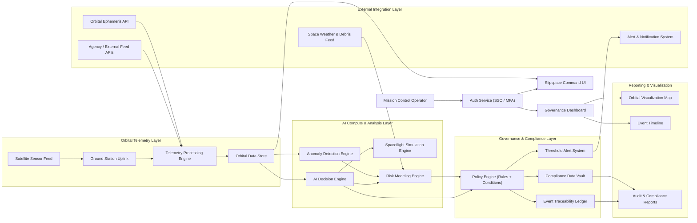

📄 README.md for slipspace-labs
# Slipspace Labs — Space Compute Governance R&D Platform

Slipspace is an experimental research- and design-focused platform exploring how orbital telemetry, AI analysis, and governance frameworks could be combined to build next-gen space-compute governance systems. This repository contains conceptual architecture, telemetry processing models, governance logic, and prototype documentation for a bold vision of satellite-enabled compute and compliance.

---

## 🔭 Vision & Mission

Slipspace aims to explore:

- Autonomous satellite compute and data processing powered by orbital telemetry.  
- AI-driven risk modeling, anomaly detection, and policy-based governance for space assets.  
- Transparent governance, auditability, and compliance for future space-based infrastructure.  
- A unified interface and control layer for mission operators, auditors, and stakeholders — blending UI, backend logic, and policy automation.

---

## 🧱 Architecture & System Overview

📁 Repository Structure
/docs        → Research notes, design docs, telemetry & governance specs  
/diagrams    → Architecture diagrams (Mermaid, exports, Figma prototypes)  
/src         → Prototype scripts, AI modules, simulation logic, API mocks  

⚙️ What’s Inside Now

Conceptual architecture diagram (above)

Placeholders for docs, diagrams, and source code — ready to be built out

Initial research notes (to be added)

Governance and telemetry processing design — upcoming

🚀 Next Steps & Roadmap

Flesh out telemetry data model and processing pipeline design

Draft policy & governance logic specifications in /docs

Begin prototype AI decision engine (e.g. anomaly detection, risk engine) in /src

Export diagram to Figma for stylized UI/UX mockups

Build UI mockups for command interface and governance dashboard

📬 Contact & Collaboration

This is a personal R&D project. If you’re inspired by Slipspace or want to collaborate:

Reach out to me via GitHub

